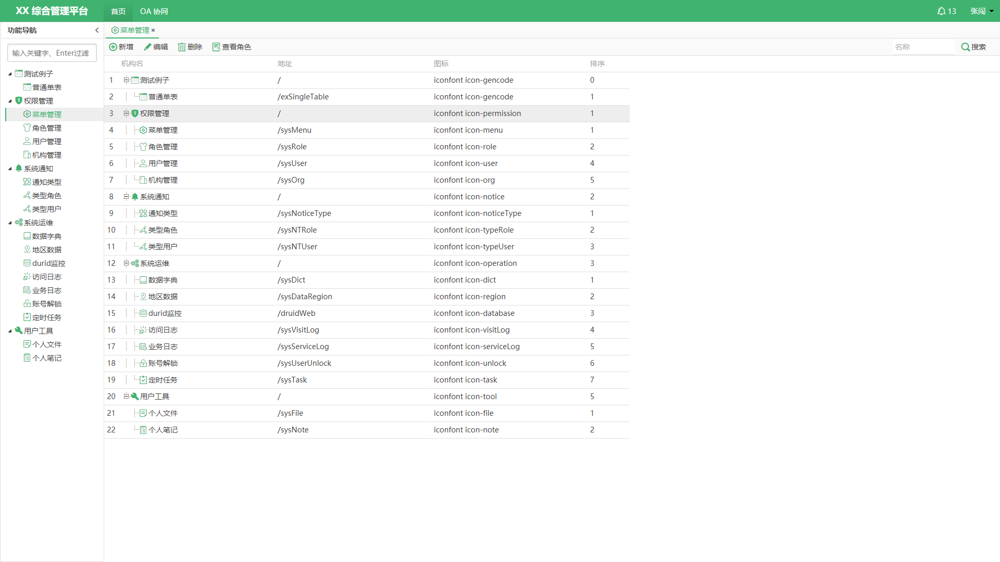
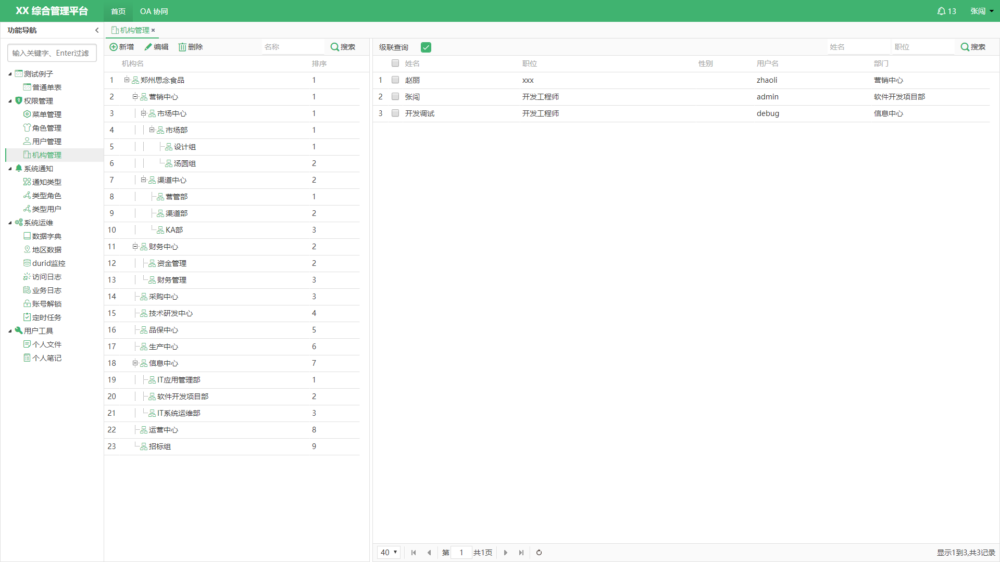
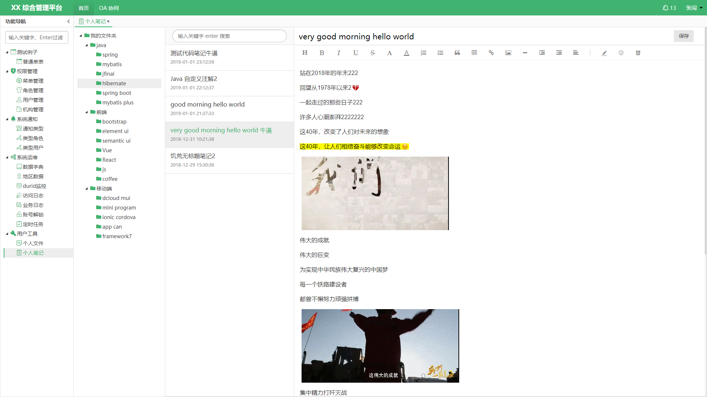
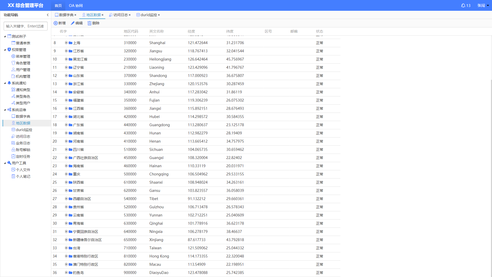

# my_curd_pro

#### 项目介绍
基于 jfinal oracle easyui 快速开发后台脚手架。
1. 权限管理
2. 代码生成器
3. 基于websocket系统通知
4. 前台多主题配色

#### 系统环境、架构
1. JDK8 以上
2. oracle 11g
3. jfinal3.5 、freemarker、 easypoi3.2.0 、slf4j .....
4. easyui1.6.10 、 pure.css 、layer .....

#### 预览

#### 安装教程

1. clone 本项目后，将database 目录下的 MYCURD.sql 导入 数据库
2. 将项目导入IDE 中，修改数据库 jdbc.properties 配置信息，运行项目

#### 使用说明

1. 管理员密码 admin 111111
2. 文档 详见 wiki, 如 wiki 中没有，请看代码。
3. 本项目仅交流学习，也可商用 :grin:

#### 参与贡献

1. Fork 本项目
2. 新建 Feat_xxx 分支
3. 提交代码
4. 新建 Pull Request